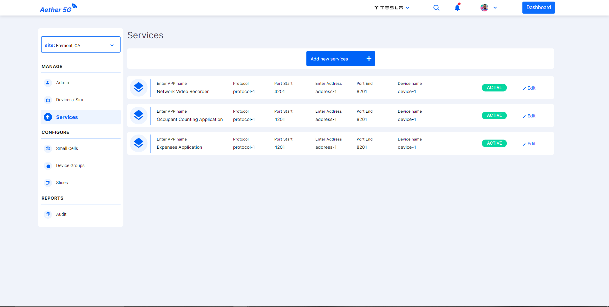
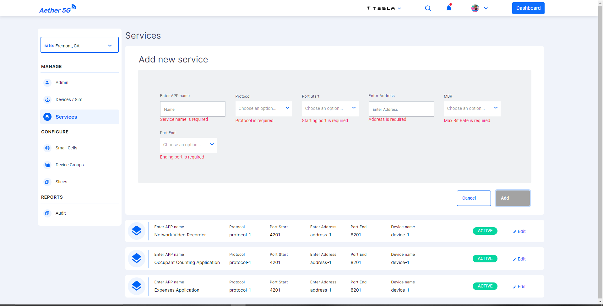
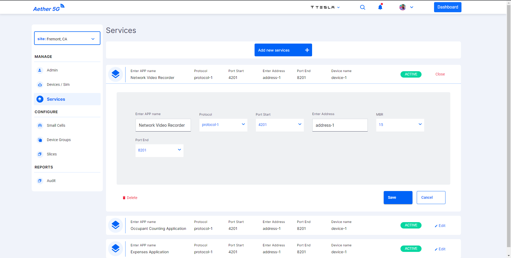

# Services Component

Services Component is used to handle the Services(Applications) supported by the Organization. The default view of the Services panel is as shown below:

- User can add a new service to the Organization using **Add new services** button in top of the screen.
- Once the user clicks they can see the screen to add the service details.

  

- User has to fill the required details and press **Add** button or the required fields will be highlighted as shown below:

  

- The added services details can also be edited.

  

- In edit service screen user has an option to delete the service. The action will trigger and open dialog.
- The dialog can be viewed in the [`Dialog Components`](/src/app/Modules/settings/dialogs/dialogs.md).

## Developer Information

### Implementation

When the **Services Component** is loaded:

- A function is called to set the current Site.
- A REST-API request is sent as a GET to [https://chronos-dev.onlab.us/chronos-exporter/config](https://chronos-dev.onlab.us/chronos-exporter/config).
- This request returns the info of the services(applications) available for the site.
- Mat Select is used for the dropdowns in the edit and add services view.
- As the API is only available for fetching the services.
- The fetched services are added into the array.
- All the CRUD operations that are performed after the initial fetch are handled in the frontend.
- Using Array methods like push, splice etc these CRUD operations are performed.
